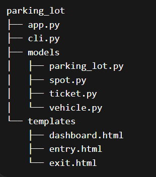
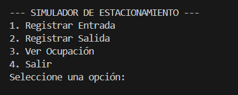
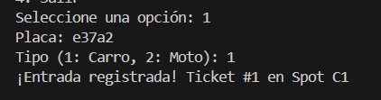
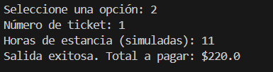
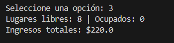

+++
date = '2026-02-16T18:07:31-08:00'
draft = false
title = 'Practica_2: Paradigma orientado a objetos'
+++

## Introduccion

En este documento se describe el proceso y los conceptos básicos de la programación orientada a objetos, a través del desarrollo de un programa sencillo implementado en el lenguaje Python utilizando este paradigma. El objetivo es facilitar la comprensión de dichos conceptos mediante un ejemplo práctico.

El programa consiste en un sistema que simula la gestión de un estacionamiento (parking), en el cual se pueden administrar los vehículos que ingresan y salen, así como calcular las ganancias generadas por cada automóvil.


## Modelo del dominio

El modelo del dominio se refiere a todas aquellas clases que representen la entidades del sistema, junto con sus atributos y sus metodos. Estas clases modelan objetos reales com opodrian ser un auto, una moto o un ticket


### Lista de clases

En el progrma se utilizaron 6 clases principales las cuales fueron parking_lot, parking_Spot, vehicle, car y motorcycle, ticket y  rate_Policy donde cada un cumple con una funcion espesifica e importante:

**ParkingLot**
Clase principal que administra el estacionamiento. Se encarga de registrar la entrada y salida de vehículos, asignar espacios disponibles y calcular los ingresos totales.

**ParkingSpot**
Representa un espacio de estacionamiento. Controla si está ocupado o libre y qué tipo de vehículo puede aceptar.

**Vehicle**
Clase base que representa un vehículo dentro del sistema.

**Car / Motorcycle**
Subclases de Vehicle que permiten diferenciar tipos de vehículos y aplicar reglas específicas mediante herencia.

**Ticket**
Representa el registro de entrada de un vehículo. Contiene información como el vehículo, el espacio asignado y el estado del ticket.

**RatePolicy**
Define la lógica de cálculo de tarifas. Permite aplicar polimorfismo al cambiar la forma en que se calcula el costo.


## Conseptos de Programacion Orientada a Objetos 

**Encapsulacion:** es el principio de agrupar datos (atributos) y los métodos que operan sobre ellos en una única unidad, llamada clase, restringiendo el acceso directo a los componentes internos.
Ejemplo dentro del programa:
``````python

class ParkingSpot:
    def __init__(self, spot_id: str, allowed_type: str):
        self.spot_id = spot_id
        self.allowed_type = allowed_type
        self.__occupied = False  # estado protegido
        self.current_vehicle = None

    def park(self, vehicle):
        self.__occupied = True
        self.current_vehicle = vehicle

    def release(self):
        self.__occupied = False
        self.current_vehicle = None
    
    @property
    def is_occupied(self):
        return self.__occupied

``````
en este fragmento se puede observar el encapsulamiento ya que __occupied es privada y no se puede modificar directamente, se accede con @property

**abstraccion:** La abstracción se aplica mediante la clase RatePolicy, que define una interfaz común para el cálculo de tarifas a través del método calculate. Esta clase no implementa directamente la lógica, sino que establece un contrato que deben seguir las clases que hereden de ella.

De esta manera, se separa la lógica de cálculo del resto del sistema, permitiendo cambiar o extender las políticas de cobro sin afectar otras partes del programa.

``````python
class RatePolicy:
    def calculate(self, hours, vehicle_type):
        pass


class HourlyRatePolicy(RatePolicy):
    def calculate(self, hours, vehicle_type):
        if vehicle_type == "CAR":
            return hours * 20
        else:
            return hours * 10   
``````

**composicion:** La composición se aplica en la clase ParkingLot, la cual administra una colección de objetos ParkingSpot y Ticket. Estos objetos son creados y gestionados internamente por el estacionamiento, lo que indica una relación de “todo-parte”.

Por ejemplo, ParkingLot crea y almacena los espacios disponibles en una lista (__spots) y mantiene los tickets activos en una estructura (__active_tickets). Esto implica que los objetos ParkingSpot y Ticket dependen del ciclo de vida del ParkingLot.

````python
class ParkingLot:
    def __init__(self, total_car_spots, total_moto_spots, policy):
        self.__spots = []              # contiene ParkingSpot
        self.__active_tickets = {}     # contiene Ticket
        self.__policy = policy

        # creación de spots (composición)
        for i in range(total_car_spots):
            self.__spots.append(ParkingSpot(f"C{i}", "CAR"))

        for i in range(total_moto_spots):
            self.__spots.append(ParkingSpot(f"M{i}", "MOTORCYCLE"))
````

**Herencia:** La herencia se aplica mediante la clase base Vehicle, de la cual derivan las clases Car y Motorcycle. Estas subclases reutilizan los atributos y comportamiento definidos en la clase padre, evitando duplicación de código.

`````python
class Vehicle:
    def __init__(self, plate: str, vehicle_type: str):
        self.plate = plate
        self.vehicle_type = vehicle_type


class Car(Vehicle):
    def __init__(self, plate: str):
        super().__init__(plate, "CAR")


class Motorcycle(Vehicle):
    def __init__(self, plate: str):
        super().__init__(plate, "MOTORCYCLE")

``````

**Polimorfismo:** El polimorfismo se aplica en la clase ParkingLot al utilizar la interfaz común calculate definida en RatePolicy. En el método exit_vehicle, el cálculo del costo se realiza mediante self.__policy.calculate(...), sin depender de una implementación específica.

``````python

def exit_vehicle(self, ticket_id: int, hours_simulated: float):
    if ticket_id not in self.__active_tickets:
        return None
    
    ticket = self.__active_tickets.pop(ticket_id)
    
    cost = self.__policy.calculate(hours_simulated, ticket.vehicle.vehicle_type)
    
    ticket.spot.release()
    ticket.close_ticket()
    self.__total_revenue += cost
    
    return cost

``````

## MVC oon Flask

El sistema implementa el patrón de arquitectura Modelo-Vista-Controlador (MVC) utilizando Flask.

El Modelo (Model) está compuesto por las clases ubicadas en la carpeta models, donde se define la lógica del negocio del sistema, incluyendo la gestión de vehículos, espacios, tickets y tarifas.

La Vista (View) corresponde a las plantillas HTML ubicadas en la carpeta templates, las cuales permiten la interacción con el usuario mostrando información como la ocupación del estacionamiento y formularios para registrar entradas y salidas.

El Controlador (Controller) se implementa en el archivo app.py, donde se definen las rutas de Flask. Este componente recibe las solicitudes del usuario, invoca los métodos del modelo y devuelve las vistas correspondientes.

**estructura y flujo del programa**



**Salidas en terminal**

menu principal



registrar entrada



registrar salida



ocupados


## Prueba Manual

### **Prueba 1: Registro completo de vehículo**
1. Acceder al sistema en http://127.0.0.1:5000/
2. Ir a la sección "Entrada"
3. Ingresar una placa (ej: ABC123)
4. Seleccionar tipo "Carro"
5. Registrar entrada
6. Ir a la sección "Salida"
7. Ingresar el ID del ticket generado
8. Ingresar horas (ej: 2)
9. Registrar salida

**Resultado esperado:**

El vehículo se registra correctamente
Se genera un ticket
Se calcula el costo
El lugar se libera

**Resultado obtenido:**

El sistema registró la entrada correctamente
Se generó un ticket válido
Se calculó el costo correctamente
El espacio fue liberado exitosamente


### **Prueba 2: Consulta de ocupación** ###


1. Acceder al dashboard
2. Registrar uno o más vehículos
3. Observar la cantidad de espacios ocupados y libres

**Resultado esperado:**

Los espacios ocupados aumentan
Los espacios libres disminuyen

**Resultado obtenido:**

El sistema actualiza correctamente la ocupación
Los datos mostrados coinciden con las acciones realizadas
## Conclusiones

En esta práctica se aplicaron los conceptos fundamentales de la programación orientada a objetos, como encapsulación, abstracción, herencia y polimorfismo, los cuales permiten organizar mejor el código y hacerlo más mantenible. Además, se implementó el patrón MVC utilizando Flask, separando la lógica del sistema, la interfaz y el control.

Gracias a esto, se logró desarrollar un sistema funcional de estacionamiento que es claro, escalable y fácil de modificar.

## Referencias

Ichi.pro. (s.f.). Conceptos de programación orientada a objetos: encapsulación, abstracción, herencia y polimorfismo. Recuperado de:
https://ichi.pro/es/conceptos-de-programacion-orientada-a-objetos-oop-encapsulacion-abstraccion-herencia-y-polimorfismo-236476330085767

StudySmarter. (s.f.). Conceptos de POO: clases y objetos. Recuperado de:
https://www.studysmarter.es/resumenes/ciencias-de-la-computacion/programacion-de-computadoras/conceptos-de-poo/

Historia de la Empresa. (s.f.). ¿Qué es la programación orientada a objetos?. Recuperado de:
https://historiadelaempresa.com/que-es-la-programacion-orientada-a-objetos