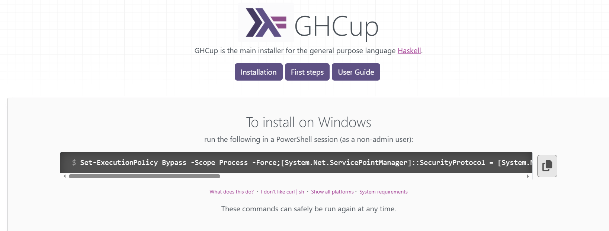
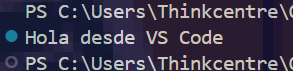
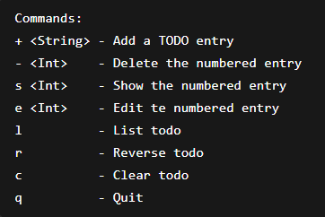

+++
date = '2026-02-16T18:07:38-08:00'
draft = false
title = 'Practica_3'
+++

## Introduccion

En el presente documento se describe el proceso de instalación y configuración del entorno de desarrollo necesario para trabajar con el lenguaje de programación Haskell utilizando el editor Visual Studio Code, así como una breve explicación de sus fundamentos.

Haskell es un lenguaje de programación de paradigma funcional que se caracteriza por ofrecer un nivel de abstracción más alto en comparación con lenguajes tradicionales como C, C++, Python o Java. A diferencia de estos, que siguen un enfoque imperativo, Haskell adopta un estilo declarativo en el que el programador se enfoca en describir qué resultado desea obtener.
Caracterisado principalmente por su pureza funcional, donde las funciones no generan efectos secundarios, su sistema de tipado estático fuerte, que permite detectar errores antes de la ejecución y el uso de la evaluación perezosa, lo que optimiza el uso de recursos al ejecutar solo lo necesario.

Gracias a estas cualidades, Haskell es un lenguaje potente y preciso, utilizado principalmente en entornos académicos y en el desarrollo de software donde se requiere alta confiabilidad. En este documento se mostrará cómo preparar el entorno y ejecutar una aplicación básica para comprender su funcionamiento.

## Lenguaje de programacion Hazkell

Haskell es un lenguaje de programación puramente funcional que fue desarrollado en los años 80 y 90. Se basa en el cálculo lambda y es conocido por su semántica no estricta y su tipado fuerte. Haskell promueve la inmutabilidad de los datos, lo que significa que una vez que se asigna un valor a una variable, este valor no puede ser modificado, lo que facilita la creación de programas más seguros y predecibles. Además, Haskell es ampliamente utilizado en campos como la inteligencia artificial, la bioinformática y las finanzas, lo que lo convierte en un lenguaje muy potente y flexible.

Con su pu­bli­ca­ción, Haskell se convirtió prá­c­ti­ca­me­n­te en el estándar de los lenguajes de pro­gra­ma­ción fu­n­cio­na­les. Más tarde, se de­sa­rro­lla­ron numerosos derivados como Parallel Haskell, Eager Haskell, Haskell++ o Eden, que están es­tre­cha­me­n­te alineados con Haskell. Algunos de los lenguajes de pro­gra­ma­ción más modernos también se basan en Haskell. Por ejemplo, el lenguaje universal Python, uno de los lenguajes de pro­gra­ma­ción de internet más im­po­r­ta­n­tes, ha adoptado la notación lambda y la sintaxis de pro­ce­sa­mie­n­to de listas de Haskell.

## Como Instalarlo 

Para instalar Haskell, primero es necesario descargar GHCup, que es la herramienta oficial encargada de instalar todo el entorno de desarrollo necesario.

Para ello, se debe ingresar a la página oficial de GHCup:
https://www.haskell.org/ghcup/

Ahí se muestra la documentación junto con el comando de instalación. Este comando se debe copiar y pegar en una ventana de PowerShell (es importante no abrirla como administrador).

Una vez ejecutado el comando, comenzará el proceso de instalación. Durante este proceso, GHCup descargará e instalará automáticamente herramientas importantes como el compilador (GHC), el gestor de paquetes (Stack), entre otros componentes necesarios. Es posible que el proceso tarde algunos minutos dependiendo de la velocidad de internet y del equipo.



Para verificar que la instalación se realizó correctamente, se pueden ejecutar los siguientes comandos en la terminal de PowerShell:
````PowerShell
ghc --version
````
o en su defecto
````PowerShell
stack --version
````
Si al ejecutar cualquiera de estos comandos aparece la versión instalada, significa que el entorno se instaló correctamente y está listo para usarse.

Una vez instalado todo el entorno, el siguiente paso es configurar el editor de código Visual Studio Code para poder desarrollar y ejecutar programas en Haskell de forma más cómoda.

Para ello, se deben instalar las extensiones oficiales de Haskell dentro de VS Code. Esto se hace entrando a la sección de extensiones del editor y buscando “Haskell”. Las extensiones principales permiten tener autocompletado, resaltado de sintaxis, detección de errores y mejor integración con el lenguaje.

!


Estas extensiones facilitan mucho el desarrollo, ya que ayudan a escribir código más rápido, detectar errores en tiempo real y ejecutar programas directamente desde el editor.

## Primer Programa en Haskell

Una ves descargadas las extenciones de Hazkell podemos empezar a realizar nuestro primer programa en hakell sencillo, el clasico hola mundo.

````hazkell
-- Programa sencillo en Haskell

main :: IO ()
main = do
    putStrLn "Hola mundo"
````


En este ejemplo para imprimir el clasico texto "Hola mundo" consta de varios elementos:

   1) "main :: IO()" es la firma de la funcion indica que es la funcion principal del programa, es el equivalente de "int main()" en C.

**main:**  es la función principal (por donde empieza el programa).

**IO:**  significa que el programa va a interactuar con el usuario (entrada/salida).

**( ):** indica que no devuelve un valor importante, solo ejecuta acciones.

2) main = do: Aquí defines qué va a hacer el programa,Es como decir que a partir de aquí vienen las instrucciones.

**do:** se usa cuando vas a ejecutar varias acciones en orden, en este caso solo va a imprimir texto.

3) putStrLn "Hola mundo": esta es la accion o proceso que va a realizar el programa al ejecutarce y despues pone un salto de pagina.

**putStrLn:** es una función que imprime texto en la pantalla.

**"Hola mundo":** es el mensaje que se va a mostrar y al igual que la mayoria de los lenguajes de programacion, los texto que se van a mostrar en pantalla se colocan entre comillas dobles.


A continuacion se muestra otro ejemplo mucho mas elaborado el cual es un blog echo con Haskell èl cual se encuentra en un repositorio en GitHub (https://github.com/steadylearner/Haskell/tree/main/examples/blog/todo):

````Haskell

-- https://www.fpcomplete.com/haskell/tutorial/stack-script/
-- #!/usr/local/bin/env stack
-- stack --resolver lts-12.21 script

module Main where

import Configuration.Dotenv (defaultConfig, loadFile)
import Lib (prompt)
import System.Environment (lookupEnv)
import Web.Browser (openBrowser)

-- $stack run

-- $stack build

-- $stack install

-- $stack install --local-bin-path <dir>

-- $stack install --local-bin-path .

-- $./text-exe

-- $stack Main.hs

-- $chmod +x Main.hs

-- $./Main.hs

-- Should include .env and open browser.

main :: IO ()
main = do
  loadFile defaultConfig
  website <- lookupEnv "WEBSITE"

  case website of
    Nothing -> error "You should set WEBSITE at .env file."
    Just s -> do
      result <- openBrowser s
      if result
        then print ("Could open " ++ s)
        else print ("Couldn't open " ++ s)

      putStrLn "Commands:"
      putStrLn "+ <String> - Add a TODO entry"
      putStrLn "- <Int>    - Delete the numbered entry"
      putStrLn "s <Int>    - Show the numbered entry"
      putStrLn "e <Int>    - Edit te numbered entry"
      putStrLn "l          - List todo"
      putStrLn "r          - Reverse todo"
      putStrLn "c          - Clear todo"
      putStrLn "q          - Quit"
      prompt [] -- Start with the empty todo list.

-- putStrLn "Commands:"
-- putStrLn "+ <String> - Add a TODO entry"
-- putStrLn "- <Int>    - Delete the numbered entry"
-- putStrLn "s <Int>    - Show the numbered entry"
-- putStrLn "e <Int>    - Edit te numbered entry"
-- putStrLn "l          - List todo"
-- putStrLn "r          - Reverse todo"
-- putStrLn "c          - Clear todo"
-- putStrLn "q          - Quit"
-- prompt [] -- Start with the empty todo list.
````
### **Salida**


### **Como funciona el codigo** 
Esta aplicación ya es una TODO real, o sea, sirve para gestionar tareas desde la terminal.

Permite cosas como:****

- Agregar tareas   
- Eliminarlas  
- Verlas  
- Editarlas  
- Limpiar la lista

Además, al iniciar intenta abrir un navegador con una página web que tú defines en un archivo .env.

### **¿Cómo se ejecuta?**

Se puede ejecutar con Stack de varias formas:
````Bash
stack run
````
o directamente como script:
````Bash
stack main.hs
````
### **¿Cómo se crea con Stack?**

Normalmente se hace así:
````Bash
stack new todo-app
cd todo-app
stack build
stack run
````
este comando crea un stack y ingresa en ella, después reemplazas el contenido de Main.hs con este código

### **¿que hace exactamente el codigo?**

````Haskell
import Configuration.Dotenv
import Lib
import System.Environment
import Web.Browser
````
importa todo lo necesario para:
- Leer variables .env
- Usar la función prompt
- Leer variables del sistema
- Abrir el navegador

````Haskell
main :: IO ()
main = do
````
Inicia el programa, desde aqui empieza toda la ejecucion de el programa y se define todo el proceso necesario

````Haskell
loadFile defaultConfig
````
carga archivos .env el cual contiene variables como "WEBSITE=google.com"

````Haskell
website <- lookupEnv "WEBSITE"
````
obtiene la variable WEBSITE para usar una URL guardada

````Haskell
case website of
  Nothing -> error "You should set WEBSITE..."
````
si no existe marca error junto con un mensaje indicando el error 

````Haskell
Just s -> do
````
si si existe, continua con el proceso

````Haskell
result <- openBrowser s

if result
  then print ("Could open " ++ s)
  else print ("Couldn't open " ++ s)
````
intenta abrir la pagina web y muestra si funciono o no 

````Haskell
putStrLn "Commands:"
````
Muetra todas las funciones disponibles que el programa puede realizar (agregar, eliminar, listar, salir)

````Haskell
prompt []
````
Por ultimo se inicializa la lista como una lista vacia, la funcio prompt es la que maneja todas las operaciones del sistema


[Portafolio Github](https://github.com/andresmendez52-sys/portafolio)

[sitio HUGO](https://andresmendez52-sys.github.io/portafolio/)